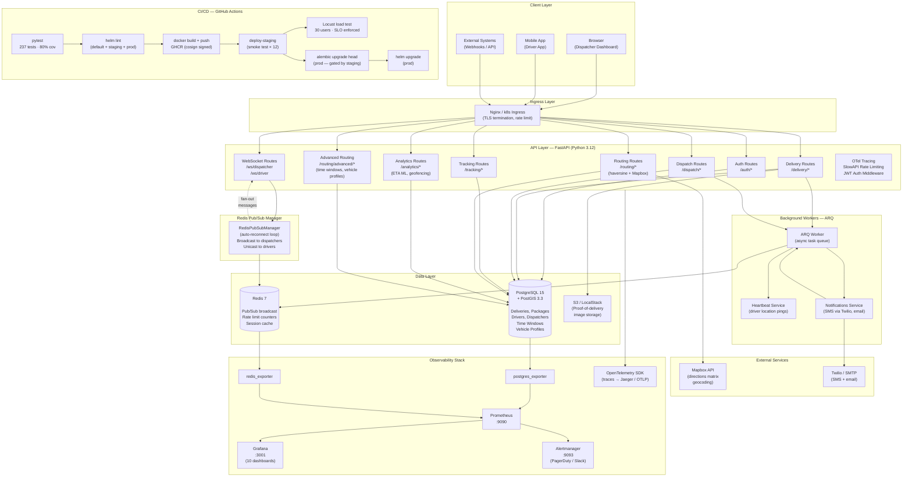
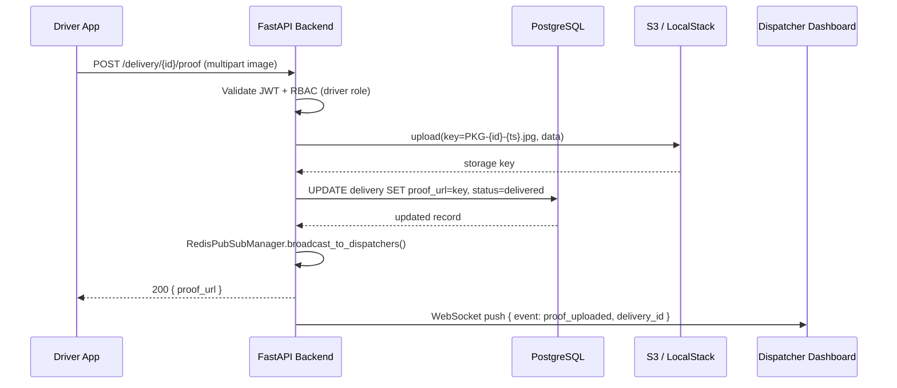
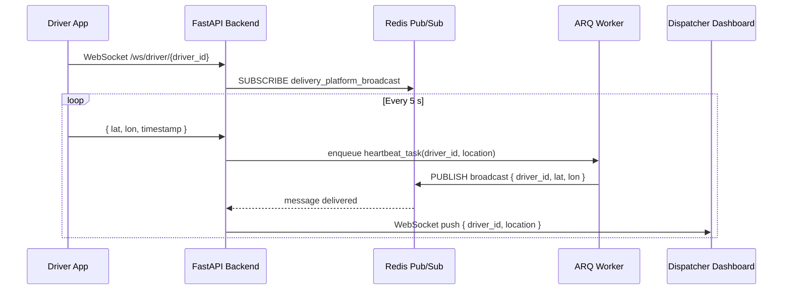
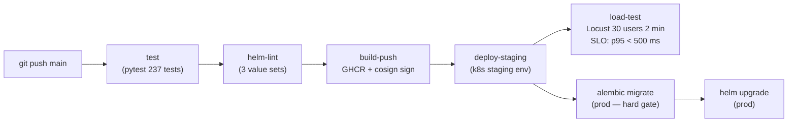

# Delivery Intelligence Platform — Architecture

## System Architecture Diagram

---

## Component Inventory

| Component | Technology | Port | Notes |
|---|---|---|---|
| API Backend | FastAPI + Uvicorn | 8002 | Async, OTel-instrumented |
| Database | PostgreSQL 15 + PostGIS 3.3 | 5434 | Geospatial queries, Alembic migrations |
| Cache / PubSub | Redis 7 | 6379 | Pub/Sub for WebSocket fan-out; rate limiting |
| Background Workers | ARQ (asyncio task queue) | — | Delivery events, heartbeat, notifications |
| Proof Storage | S3 / LocalStack (dev) | 4566 | SHA-keyed images, pre-signed URLs |
| Routing Engine | Mapbox API + haversine 2-Opt | — | Falls back to haversine when no token |
| ML / Analytics | scikit-learn ETAPredictor | — | Trained model persisted to disk |
| Geofencing | Shapely + PostGIS | — | Circular zones + polygon containment |
| Metrics | Prometheus + postgres/redis exporters | 9090 | Scraped every 15 s |
| Dashboards | Grafana | 3001 | 10 pre-built panels |
| Alerting | Alertmanager | 9093 | PagerDuty + Slack receivers |
| Tracing | OpenTelemetry SDK | — | OTLP export (disabled in tests) |
| Object Store (dev) | LocalStack | 4566 | Emulates S3, SQS, SNS |

---

## Data Flow: Proof-of-Delivery Upload

---

## Data Flow: Real-Time Driver Tracking

---

## CI/CD Pipeline

---

## Security Controls

| Layer | Control |
|---|---|
| Transport | TLS via cert-manager (Let's Encrypt) |
| Authentication | JWT (HS256), bcrypt password hashing |
| Authorization | RBAC (admin / dispatcher / driver) via FastAPI deps |
| Rate Limiting | SlowAPI (per-IP, per-endpoint limits) |
| Input Validation | Pydantic v2 strict schemas on all endpoints |
| Secrets | `.env` file (never committed); Docker secrets in production |
| Dependencies | pip-compile with SHA-256 hashes (`--require-hashes`) |
| Images | Cosign-signed GHCR images; non-root container user |
| Storage | LocalStorage blocked in production; S3 enforced |
| Monitoring | Alertmanager → PagerDuty on error rate / latency SLO breach |
